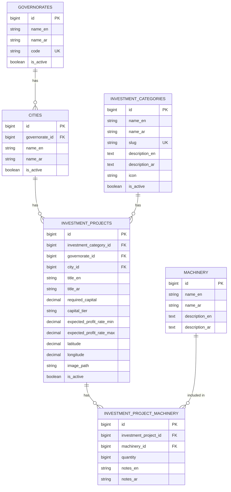

# Syrian Investment Ideas Bank

**Syrian Investment Ideas Bank** is a public REST API that displays Syrian investment ideas and their details. It is a small **educational MVP** built with **Laravel 12** to practice consuming a Laravel REST API from a separate frontend.

- **Description:** Public REST API for Syrian investment ideas.
- **Base URL:** `http://localhost:8000/api/v1`

This is a **backend-only** project. It does not include any frontend code or frontend documentation.

---

## Educational MVP Scope

This is a small educational MVP. The backend exposes public, read-only endpoints and intentionally does **not** implement:

- Authentication, registration, or user accounts
- Users, roles, or permissions
- Admin dashboards or CRUD management APIs
- Search, filtering, sorting, or pagination
- Favorites
- Reviews or comments
- Payments
- Prospective investor contact requests

The frontend receives the **complete active investment-project list** and performs search, filtering, sorting, pagination, and favorites **locally**. These features are outside the backend API scope.

> **No authentication is required.** All endpoints are publicly accessible.

> **Profit rates are educational estimates and are not financial guarantees.**

---

## Technology Stack

- **Backend:** Laravel 12 (PHP 8.2+)
- **Database:** MySQL (or SQLite for a quick local start)
- **Composer** for dependency management
- **Pint** for code style
- **PHPUnit** for feature tests

---

## Database Entities

| Entity | Table | Purpose |
|--------|-------|---------|
| Governorate | `governorates` | Syrian governorate (bilingual name, code) |
| City | `cities` | City belonging to a governorate (bilingual name) |
| Investment Category | `investment_categories` | Project category (bilingual name, slug, icon) |
| Investment Project | `investment_projects` | An investment idea with bilingual text, capital, location, profit estimates |
| Machinery | `machinery` | Equipment catalogue (bilingual name and description) |
| Project Machinery pivot | `investment_project_machinery` | Links projects to machinery with quantity and notes |

### Entity Relationships

- A **Governorate** has many **Cities**.
- A **City** belongs to one **Governorate**.
- An **Investment Category** has many **Investment Projects**.
- An **Investment Project** belongs to one **Investment Category**, one **Governorate**, and one **City**.
- An **Investment Project** has many **Machinery** items, and a **Machinery** item can belong to many projects (many-to-many through the pivot table).

### Mermaid ER Diagram



---

## Investment Categories

The expected investment categories are seeded by default:

| Slug | English | Arabic |
|------|---------|--------|
| `technology` | Technology | التكنولوجيا |
| `agriculture` | Agriculture | الزراعة |
| `industry` | Industry | الصناعة |
| `commerce` | Commerce | التجارة |

## Capital Tiers

Each project has a capital tier:

| Tier | Meaning |
|------|---------|
| `small` | Small required capital |
| `medium` | Medium required capital |
| `large` | Large required capital |

---

## Public Read-Only API Behavior

- All endpoints are versioned under `/api/v1`.
- All endpoints are **public** — no authentication is required.
- All endpoints are **read-only** — no create, update, or delete operations.
- `GET /api/v1/investment-projects` returns **all active projects**.
- The project list endpoint is **intentionally not paginated**.
- The project list endpoint **does not accept query parameters**.
- Search, filtering, sorting, pagination, and favorites are handled by the frontend and are outside the backend API scope.
- Inactive records are hidden from all list and detail endpoints.
- Project details include machinery requirements, location coordinates, and project images when available.

---

## Installation

Requirements: PHP 8.2+, Composer.

```bash
composer install
cp .env.example .env
php artisan key:generate
php artisan migrate:fresh --seed
php artisan storage:link
php artisan serve
```

The API is then available at `http://localhost:8000/api/v1`.

### MySQL Configuration

The project runs out of the box with SQLite. To use MySQL, set these values in `.env`:

```env
DB_CONNECTION=mysql
DB_HOST=127.0.0.1
DB_PORT=3306
DB_DATABASE=investment_ideas
DB_USERNAME=root
DB_PASSWORD=
```

Then run the migrations and seeders:

```bash
php artisan migrate:fresh --seed
```

### Migrations and Seeders

Migrations:

- `create_governorates_table`
- `create_cities_table`
- `create_investment_categories_table`
- `create_investment_projects_table`
- `create_machinery_table`
- `create_investment_project_machinery_table`

Seeders (run by `php artisan migrate:fresh --seed`):

- `GovernorateSeeder`
- `CitySeeder`
- `InvestmentCategorySeeder`
- `MachinerySeeder`
- `InvestmentProjectSeeder`

### Local Storage Link

`php artisan storage:link` creates the `public/storage` symlink so project images stored on the public disk can be served via the `image_url` field in API responses.

---

## API Endpoints

All routes are prefixed with `/api/v1`.

| Method | URI | Description |
|--------|-----|-------------|
| GET | `/api/v1/investment-projects` | List all active investment projects (not paginated, no query params) |
| GET | `/api/v1/investment-projects/{investmentProject}` | View a single active investment project |
| GET | `/api/v1/investment-categories` | List active investment categories |
| GET | `/api/v1/investment-categories/{investmentCategory}` | View a single active investment category |
| GET | `/api/v1/governorates` | List active governorates |
| GET | `/api/v1/governorates/{governorate}` | View a single active governorate |
| GET | `/api/v1/governorates/{governorate}/cities` | List active cities of a governorate |
| GET | `/api/v1/cities` | List active cities |
| GET | `/api/v1/cities/{city}` | View a single active city |
| GET | `/api/v1/machinery` | List the machinery catalogue |
| GET | `/api/v1/machinery/{machinery}` | View a single piece of machinery |

---

## Response Format

### Success (collection)

```json
{
  "success": true,
  "data": []
}
```

### Success (single resource)

```json
{
  "success": true,
  "data": {}
}
```

### Project-List Response Example

`GET /api/v1/investment-projects`

```json
{
  "success": true,
  "data": [
    {
      "id": 1,
      "title_en": "Cloud Software Development Studio",
      "title_ar": "استوديو تطوير برمجيات سحابية",
      "brief_description_en": "A medium-scale technology investment opportunity in Damascus, Damascus.",
      "brief_description_ar": "فرصة استثمارية Medium في مجال التكنولوجيا في مدينة Damascus, محافظة Damascus.",
      "category": {
        "id": 1,
        "name_en": "Technology",
        "name_ar": "التكنولوجيا",
        "slug": "technology",
        "description_en": "Software, digital services, and technology-driven ventures.",
        "description_ar": "البرمجيات والخدمات الرقمية والمشاريع التقنية.",
        "icon": "monitor"
      },
      "governorate": {
        "id": 1,
        "name_en": "Damascus",
        "name_ar": "دمشق",
        "code": "DM"
      },
      "city": {
        "id": 1,
        "governorate_id": 1,
        "name_en": "Damascus",
        "name_ar": "دمشق"
      },
      "required_capital": "45000.00",
      "currency": "USD",
      "capital_tier": "medium",
      "expected_profit_rate_min": "20.00",
      "expected_profit_rate_max": "35.00",
      "expected_profit_rate_text": "20-35%",
      "expected_return_period_months": 12,
      "is_quick_return": false,
      "image_url": null,
      "latitude": "33.5138000",
      "longitude": "36.2765000"
    }
  ]
}
```

### Project-Detail Response Example

`GET /api/v1/investment-projects/{investmentProject}`

```json
{
  "success": true,
  "data": {
    "id": 1,
    "title_en": "Cloud Software Development Studio",
    "title_ar": "استوديو تطوير برمجيات سحابية",
    "brief_description_en": "A medium-scale technology investment opportunity in Damascus, Damascus.",
    "brief_description_ar": "فرصة استثمارية Medium في مجال التكنولوجيا في مدينة Damascus, محافظة Damascus.",
    "full_details_en": "This is a Medium investment idea in the Technology sector located in Damascus, Damascus...",
    "full_details_ar": "هذه فكرة استثمارية Medium في قطاع التكنولوجيا تقع في مدينة Damascus, محافظة Damascus...",
    "category": {
      "id": 1,
      "name_en": "Technology",
      "name_ar": "التكنولوجيا",
      "slug": "technology",
      "description_en": "Software, digital services, and technology-driven ventures.",
      "description_ar": "البرمجيات والخدمات الرقمية والمشاريع التقنية.",
      "icon": "monitor"
    },
    "governorate": {
      "id": 1,
      "name_en": "Damascus",
      "name_ar": "دمشق",
      "code": "DM"
    },
    "city": {
      "id": 1,
      "governorate_id": 1,
      "name_en": "Damascus",
      "name_ar": "دمشق"
    },
    "required_capital": "45000.00",
    "currency": "USD",
    "capital_tier": "medium",
    "expected_profit_rate_min": "20.00",
    "expected_profit_rate_max": "35.00",
    "expected_profit_rate_text": "20-35%",
    "expected_return_period_months": 12,
    "location_description_en": "Located in Damascus, Damascus.",
    "location_description_ar": "تقع في مدينة Damascus, محافظة Damascus.",
    "latitude": "33.5138000",
    "longitude": "36.2765000",
    "is_quick_return": false,
    "image_url": null,
    "machinery": [
      {
        "id": 1,
        "name_en": "Laptop Computers",
        "name_ar": "أجهزة حاسوب محمولة",
        "description_en": "Portable computers for software and office work.",
        "description_ar": "أجهزة محمولة للعمل البرمجي والمكتبي.",
        "quantity": 12,
        "notes_en": null,
        "notes_ar": null
      }
    ],
    "created_at": "2026-01-01T00:00:00.000000Z",
    "updated_at": "2026-01-01T00:00:00.000000Z"
  }
}
```

### Validation Error Example

`GET /api/v1/investment-projects?search=tech` returns **422** because the endpoint does not accept query parameters.

```json
{
  "success": false,
  "message": "Search, filtering, sorting, and pagination are handled by the frontend. This endpoint does not accept query parameters.",
  "errors": {
    "query": [
      "Unsupported query parameters were provided."
    ]
  }
}
```

### Not-Found Response Example

`GET /api/v1/investment-projects/9999`

```json
{
  "success": false,
  "message": "Resource not found."
}
```

---

## Running Tests

```bash
php artisan test
```

## Code Style

```bash
vendor/bin/pint
```

---

## Seeder-Data Summary

Running `php artisan migrate:fresh --seed` seeds:

- **14 Syrian governorates** (bilingual names and codes).
- **25+ cities** across the governorates.
- **4 investment categories** (Technology, Agriculture, Industry, Commerce).
- **12 machinery items** in the equipment catalogue.
- **40+ active investment projects**, each with bilingual text, a capital tier, expected profit-rate estimates, location coordinates, and machinery requirements.
